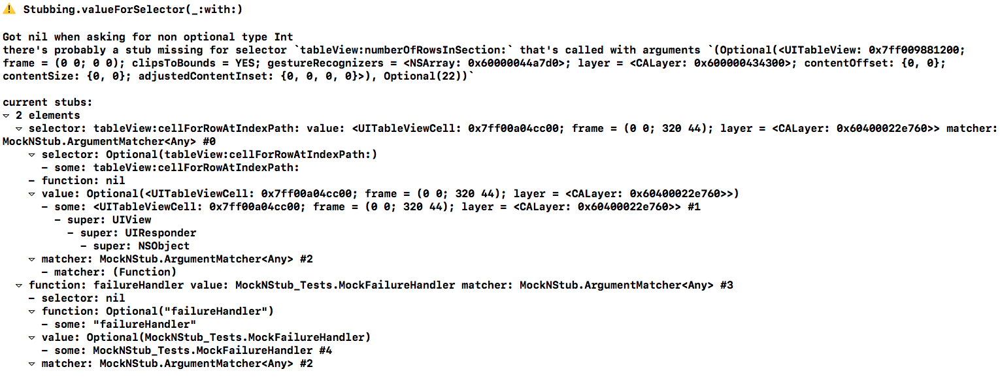

# Mock 'N Stub

[](http://cocoapods.org/pods/Zoomy) [](http://cocoapods.org/pods/Zoomy) [](LICENSE)

Code completed Mocking and Stubbing for Swift protocols and classes.

## Example

To see the example project, run the following in your terminal:

`pod try MockNStub`

## Setup

Just add:

```Swift
import MockNStub
```

to the files where you need to create mocks or stubs.

## All Mocks are Stubs

All created mocks conform to the `Mocking` protocol and since `Mocking` conforms to the `Stubbing` protocol, all created mocks can automatically be used as stubs too.

Wenever you feel that an explicit stub needs to support `Mocking`, all you need to do is change it's conformance from `Stubbing` to `Mocking`. 

## Class and Protocol Mocks/Stubs share the exact same interface
The implementations in MockNStub are completely protocol oriented. This allows the interface of class and protocol mocks (and stubs) to be exactly the same. All explicit stubs conform to `Stubbing` and all mocks conform to `Mocking`. There's never a need to inherit from a concrete type from this library.

## Two ways of creating fakes

We can create mocks stubs in two ways; using `@objc` **selectors** and using **functions** (or more specifically their names). While using the function names to create [stubs](###Creating-stubs) and [mocks](###Creating-mocks) is a bit faster because the function name is known (and therefore doesn't have to be provided) within the function scope of the stub or mock, it's more error (typo) prone when using these fakes because identifying methods by their names from the outside of the fake does (currently) not currently support code completion or inference. 

Therefore identifying methods using selectors is the recommended way. However some methods can't be identified using selectors because they use swift types that can't be represented in objc. The compiler will let you know when this is the case.

When your fake inherits from NSObject in whatever way, there's no need to prefix it's methods with `@objc `, when it isn't the compiler will let you know and give helpful quick fixes.

When creating fakes (mocks or stubs) and identifying them using their function names, it can be helpful to store these names in constants. Proper support for enums with this purpose will be added soon.

When creating fakes and identifying them using their selectors, it can be helpful to leverage Xcode's code snippets to avoid having to type `#selector()` all the time. These snippets will soon be added to this repo as well.

Please note that neither the `Mocking` or `Stubbing` protocols rely on **one** way of doing this. You can mix it up whenever needed. For instance some methods in the same fake can be identified using their function names while others can be identified by their selectors.

## Stubbing
### Creating stubs
#### Using selectors
```Swift
class UITableViewDataSourceStub: Stubbing, UITableViewDataSource {

    func tableView(_ tableView: UITableView, numberOfRowsInSection section: Int) -> Int {
        return didCallSelector(#selector(tableView(_:numberOfRowsInSection:)), withArguments: tableView, section)
    }
    
    func tableView(_ tableView: UITableView, cellForRowAt indexPath: IndexPath) -> UITableViewCell {
        return didCallSelector(#selector(tableView(_:cellForRowAt:)), withArguments: tableView, indexPath)
    }
}
```
Notes:

* Everything inside `#selector()` is code completed.

#### Using function names
```Swift
class UITableViewDataSourceStub: Stubbing, UITableViewDataSource {

    func tableView(_ tableView: UITableView, numberOfRowsInSection section: Int) -> Int {
        return didCallFunction(withArguments: tableView, section)
    }
    
    func tableView(_ tableView: UITableView, cellForRowAt indexPath: IndexPath) -> UITableViewCell {
        return didCallFunction(withArguments: tableView, indexPath)
    }
}
```
Notes:

* No need to manually provide a function name.

### Adding return values to stubs
Return values can be added as many times as desired, in the case where they are provided for the same signature, the value that was last provided is returned.

#### Using selectors
Considering:

```Swift
let stub = UITableViewDataSourceStub()
```

You can add stub values like this:

```Swift
stub.given(#selector(sut.tableView(_:numberOfRowsInSection:)), willReturn: 0)
stub.given(#selector(sut.tableView(_:cellForRowAt:)), willReturn: UITableViewCell())
```

Or when needing to be more specific, like this:

```Swift
stub.given(#selector(sut.tableView(_:numberOfRowsInSection:)), withArgumentsThatMatch: ArgumentMatcher(matcher: { (args: (UITableView, Int)) -> Bool in
	return args.0 === expectedTableView && args.1 == 2
}), willReturn: 42)
```
Notes:

* Argument matcher won't match if argument types are not correct.

#### Using function names
Considering:

```Swift
let stub = UITableViewDataSourceStub()
```

You can add stub values like this:

```Swift
stub.given("tableView(_:numberOfRowsInSection:)", willReturn: 0)
stub.given("tableView(_:cellForRowAt:)", willReturn: UITableViewCell())
```

Or when needing to be more specific, like this:

```Swift
stub.given("tableView(_:numberOfRowsInSection:)"), withArgumentsThatMatch: ArgumentMatcher(matcher: { (args: (UITableView, Int)) -> Bool in
	return args.0 === expectedTableView && args.1 == 2
}), willReturn: 42)
```
Notes:

* Argument matcher won't match if argument types are not correct.

## Mocking
### Creating mocks
#### Using selectors

```Swift
class UITableViewDataSourceMock: NSObject, Mocking, UITableViewDataSource {
    
    func tableView(_ tableView: UITableView, numberOfRowsInSection section: Int) -> Int {
        return didCallSelector(#selector(tableView(_:numberOfRowsInSection:)), withArguments: tableView, section)
    }
    
    func tableView(_ tableView: UITableView, cellForRowAt indexPath: IndexPath) -> UITableViewCell {
        return didCallSelector(#selector(tableView(_:cellForRowAt:)), withArguments: tableView, indexPath)
    }
}
```
Notes:

* Every mock directly suports stubbing

#### Using function names

```Swift
class UITableViewDataSourceMock: NSObject, Mocking, UITableViewDataSource {
    
    func tableView(_ tableView: UITableView, numberOfRowsInSection section: Int) -> Int {
        return didCallFunction(withArguments: tableView, section)!
    }
    
    func tableView(_ tableView: UITableView, cellForRowAt indexPath: IndexPath) -> UITableViewCell {
        return didCallFunction(withArguments: tableView, indexPath)!
    }
}
```

### Creating expectations
#### Using selectors

Considering:

```Swift
let mock = UITableViewDataSourceMock()
```

You can add expectations like this:

```Swift
mock.expect(callToSelector:  #selector(sut.tableView(_:cellForRowAt:)))
mock.expect(callToSelector:  #selector(sut.tableView(_:numberOfRowsInSection:)))
```

Or when needing to be more specific, like this:

```Swift
mock.expect(callToSelector:  #selector(sut.tableView(_:numberOfRowsInSection:)), withArgumentsThatMatch: ArgumentMatcher(matcher: { (args: (UITableView, Int)) -> Bool in
	return args.0 === tableView && args.1 == 42                        
}))
```
#### Using function names

```Swift
let mock = UITableViewDataSourceMock()
```

You can add expectations like this:

```Swift
mock.expect(callToFunction: "tableView(_:cellForRowAt:)")
mock.expect(callToFunction: "tableView(_:numberOfRowsInSection:)")
```

Or when needing to be more specific, like this:

```Swift
mock.expect(callToFunction: "tableView(_:numberOfRowsInSection:)", withArgumentsThatMatch: ArgumentMatcher(matcher: { (args: (UITableView, Int)) -> Bool in
	return args.0 === tableView && args.1 == 42                        
}))
```

### Verifying

regardless of how methods have been identified:

```Swift
mock.verify()
```

Notes:

* This will result in an XCT failure when one ore more expectations have not been met.

### Properties

Mocking and stubbing properties is done like expected.

#### Using selectors

```Swift
var title: String {
    get {
        return didCallSelector(#selector(getter: self.title))
    }
    set {
        didCallSelector(#selector(setter: title), withArguments: newValue)
    }
}
```
Notes:

* In case you forget the `getter:` or `setter:` prefix, Xcode will friendly remind you and provide a quickfix for it.
* `self.` is needed in the getter to prevent a warning. Xcode will also provide the option to fix this automatically.

#### Using function names

```Swift
var title: String {
    get {
        return didCallFunction()
    }
    set {
        didCallFunction(withArguments: newValue)
    }
}
```

Notes:

* This get set pattern is identical on any property.

### Default return values of didCall()
Within the `Mocking` and `Stubbing` protocols there's a quite a bunch of implementations for the `didCall` methods. Because of Swifts support for type inference, the correct method will be used at compile time. For instance when `return didCallFunction()` a non void implementation of `didCallFunction()` will be used. Even more exciting, when `return didCallFunction()` is called in a method that returns a value that conforms to `ProvidingDefaultStubValue` there will be no need to unwrap the result of `didCallFunction` because the default value is known (and provided) through the default protocol implementation. Note: these default stub values will only be provided when no other values are provided through the `given...` methods.

Don't worry to much about what is explained above, long story short: your IDE will always give you the most sensible option that's available.

In the case where a type that does not conform to `ProvidingDefaultStubValue` needs to be returned. The compiler won't sugest (and allow) a version of `didCall..` that returns a nonoptional value. You can do three things in this case:

* Make that type conform to `ProvidingDefaultStubValue`
	* If you do this for a type from one of Apple's libraries, a pull request to this repo containing this extension would be highly appreciated. 
* Manually provide a default value in case nil is provided: `return didCallFunction() ?? MyType()`
* Force unwrap the return value provided by the `didCall`
	* In this case you do want to make sure a value is present using the `given..` methods.
		* When this isn't done, your test will crash when calling the stubbed or mocked method.
		* However, every force unwrap of a nil value is known before it occurs and will cause detailed diagnosics to be logged to the console which shows what was expected to happen vs. what actually happened:

#### Types that currently conform to `ProvidingDefaultStubValue`
* Most types from the Swift Standard library
* Most commonly used types from UIKit
* Most commonly used types CoreGraphics
* All types that inherit from NSObject
	* Dislaimer; these subclasses do need to adhere to the [Liskov Substitution Principle](https://en.wikipedia.org/wiki/Liskov_substitution_principle) or in simpler terms: don't have a `fatalError()` or anything similar in their `init()`

[Here's](https://github.com/mennolovink/Mock-N-stub/tree/develop/MockNStub/Classes/Extensions/ProvidingDefaultStubValue) an overview of all types that currently conform to `ProvidingDefaultStubValue `

## There's more to come..

### Planned features

Can be viewed in the [roadmap](https://github.com/mennolovink/Mock-N-stub/issues?q=is%3Aissue+is%3Aopen+label%3Aroadmap).
### Anything missing?

Create a [feature request](https://github.com/mennolovink/Mock-N-stub/issues/new) and it will likely be picked up.

## Installation

MockNStub is available through [CocoaPods](https://cocoapods.org). To install
it, simply add the following line to your Podfile:

```ruby
pod 'MockNStub'
```

## Author

mennolovink, mclovink@me.com

## License

MockNStub is available under the MIT license. See the LICENSE file for more info.
